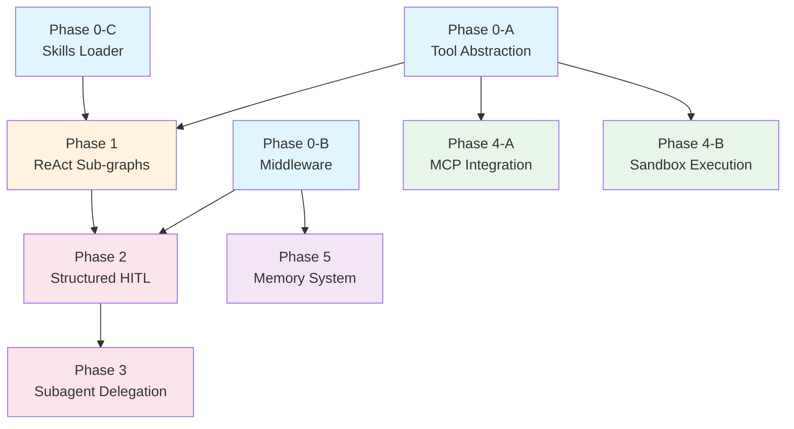

# Muse Master Roadmap — DeerFlow-Inspired Upgrade

## Design

- **Design doc:** `docs/plans/2026-03-08-deerflow-inspired-upgrade-design.md`
- **Master plan:** `docs/plans/2026-03-08-deerflow-upgrade-master-plan.md`

## Plans (9 phases, 5 waves, 65 tasks)

### Wave 1 — Foundation (parallel)
1. Phase 0-A — Tool Abstraction Layer (8 tasks)
2. Phase 0-B — Middleware Framework (7 tasks)
3. Phase 0-C — Skills Loader (7 tasks)

### Wave 2 — Core Agent Capability
4. Phase 1 — Sub-graph ReAct Conversion (12 tasks)

### Wave 3 — Interaction & Delegation
5. Phase 2 — Structured HITL (5 tasks)
6. Phase 3 — Subagent Delegation (6 tasks)

### Wave 4 — External Integration (parallel)
7. Phase 4-A — MCP Integration (7 tasks)
8. Phase 4-B — Sandbox Execution (7 tasks)

### Wave 5 — Memory
9. Phase 5 — Memory System (6 tasks)

## Dependency Graph

## Execution Rules

- 严格按 Wave 顺序推进，Wave 内可并行。
- 每个 Task 遵循 TDD：写失败测试 → 实现 → 验证通过 → 提交。
- Wave 边界运行全量测试确认无回归。
- `PROGRESS.md` 在每个 Task 完成后更新。

## Previous Plans (已完成)

以下旧计划已于 2026-03-08 之前 100% 完成并归档删除：
- Phase 0-5（冻结服务边界 → LangGraph 外壳 → 章节子图 → Citation/Composition → CLI/Runtime → 测试迁移）
- Legacy bridge cleanup
