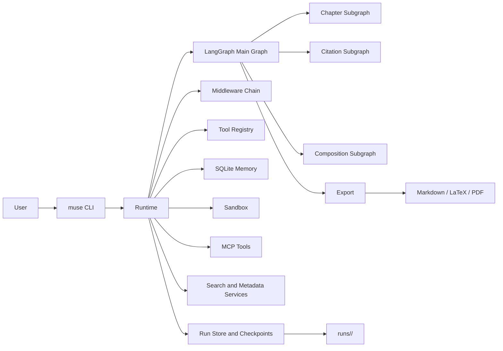

# Muse

[](https://github.com/yusleep/Muse/actions/workflows/ci.yml)


Muse 是一个面向学术论文 / 毕业论文场景的智能写作代理框架。它以 `LangGraph` 为编排内核，把文献检索、提纲生成、章节写作、引用核验、人工审阅、终稿润色与导出串成一条**可恢复、可扩展、可审计**的执行链路。

如果你第一次来到这个仓库，推荐目标很简单：**先跑起来，再决定要不要深挖架构。**

## Why Muse

- **真能跑完整流程**：不是只生成一段文字，而是覆盖 `search -> outline -> draft -> citation -> export`
- **支持中途暂停与恢复**：HITL 阶段可人工审核，状态保存在 `runs/<run_id>/`
- **适合学术写作**：内置引用核验、章节子图、LaTeX/PDF 导出
- **不是封闭黑盒**：工具、MCP、沙箱、记忆、子代理都可以继续扩展

## Quick Start

### 1. 安装

```bash
python3 -m venv .venv
.venv/bin/pip install -r requirements-dev.txt
```

### 2. 生成并编辑 `config.yaml`

```bash
cp config.example.yaml config.yaml
```

默认推荐直接编辑 `config.yaml`：它已经覆盖鉴权、provider、路由、检索、中间件和路径配置。  
优先级规则是：`CLI 参数 > 环境变量 > config.yaml > 默认值`。

最小可运行配置通常只需要：

- 在 `auth.profiles` 里填好 API Key 来源
- 在 `providers` 里启用你要使用的模型提供方
- 在 `routes.default` 里指向一个可用模型

如果你不想把密钥写进 `config.yaml`，可以继续走环境变量注入：

```bash
export MUSE_LLM_API_KEY="<your-api-key>"
export MUSE_LLM_MODEL="gpt-4.1-mini"
```

也可以显式指定配置文件路径：

```bash
.venv/bin/python -m muse --config /path/to/config.yaml check
```

### 3. 检查 CLI 与连通性

```bash
.venv/bin/python -m muse --help
.venv/bin/python -m muse check
```

### 4. 发起一次运行

```bash
.venv/bin/python -m muse run \
  --topic "多智能体系统在学术写作中的应用" \
  --discipline "Computer Science" \
  --language zh \
  --format-standard "GB/T 7714-2015" \
  --output-format markdown
```

运行产物会落到 `runs/<run_id>/`。

## Minimal Workflow

### 新建运行

```bash
.venv/bin/python -m muse run --topic "你的选题" --discipline "Computer Science"
```

### 人工审核

Muse 会在 `research`、`outline`、`draft`、`final` 等阶段暂停等待人工反馈。

```bash
.venv/bin/python -m muse review \
  --run-id <run_id> \
  --stage research \
  --approve \
  --comment "继续"
```

如果中断节点给了选项，也可以提交结构化选择：

```bash
.venv/bin/python -m muse review \
  --run-id <run_id> \
  --stage draft \
  --option guide_revision \
  --comment "请补强引用与论证"
```

### 恢复执行

```bash
.venv/bin/python -m muse resume --run-id <run_id>
```

### 导出结果

```bash
.venv/bin/python -m muse export --run-id <run_id> --output-format markdown
.venv/bin/python -m muse export --run-id <run_id> --output-format latex
.venv/bin/python -m muse export --run-id <run_id> --output-format pdf
```

- `markdown`：输出 `runs/<run_id>/output/thesis.md`
- `latex`：输出 LaTeX 工程与可上传 Overleaf 的压缩包
- `pdf`：依赖本地 `pandoc` + `xelatex`

## Architecture



- `Runtime` 负责装配 LLM、检索、记忆、沙箱、子代理和存储
- `LangGraph Main Graph` 负责主流程编排与可恢复执行
- 三个子图分别处理章节写作、引用核验、终稿整合
- 所有运行产物和状态默认都写入 `runs/<run_id>/`

## Repo Map

```text
muse/         # 运行时、图编排、工具、中间件、MCP、记忆、沙箱
tests/        # 单元测试、集成测试、E2E
runs/         # 运行产物、checkpoint、导出结果
.github/      # GitHub Actions 等仓库自动化配置
```

你最可能先点开的文件：

- `muse/cli.py`
- `muse/runtime.py`
- `muse/graph/main_graph.py`
- `muse/tools/registry.py`
- `muse/mcp/client.py`
- `muse/memory/store.py`

## Advanced Configuration

如果你已经跑通最小流程，再看这些扩展能力：

- **统一配置文件**：`config.example.yaml` → `config.yaml`
- **显式配置路径**：`--config /path/to/config.yaml` 或 `MUSE_CONFIG`
- **本地参考资料**：`MUSE_REFS_DIR` 或 `--refs-dir ./refs`
- **MCP 扩展**：`extensions.yaml` / `MUSE_EXTENSIONS_PATH`
- **中间件调优**：`MUSE_MIDDLEWARE_*`
- **导出增强**：本地 `pandoc`、`xelatex`、`latexmk`
- **兼容旧路由注入**：`MUSE_MODEL_ROUTER_JSON` / `MUSE_MODEL_ROUTER_PATH` 仍可用，但不再推荐作为首选入口

## Commands

当前 CLI 命令面：

- `check`
- `debug-llm`
- `run`
- `resume`
- `review`
- `export`

## Start Reading

- `muse/cli.py`
- `muse/runtime.py`
- `muse/graph/main_graph.py`
- `muse/tools/registry.py`
- `.github/workflows/ci.yml`

## Verification

```bash
.venv/bin/python -m muse --help
.venv/bin/python -m pytest tests/ -q
```

当前验证基线：`625 passed, 1 skipped, 6 warnings, 21 subtests passed`

## Notes

- 仓库当前没有公开声明 `LICENSE`，如需对外分发请补齐许可证
- CI badge 对应 `.github/workflows/ci.yml`
- 当引用核验发现关键矛盾项时，导出会被阻断，避免错误内容进入终稿
